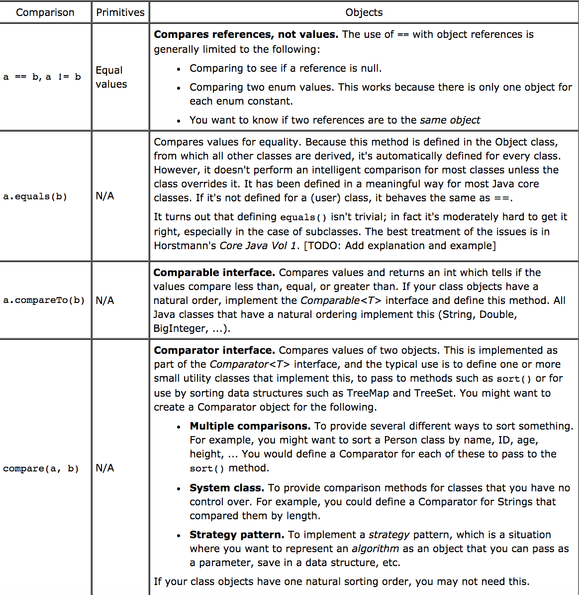

# Comparisons of references and values
[Go back to README.md](README.md)

## How are values compared? (i.e. comparing two strings)
* JAVA

  For comparing two strings, it can not use **==** operator. There is an **Objects.equals()** method that can be used to compare two strings.

  ```JAVA
  String fooString1 = new String("foo");
  String fooString2 = new String("foo");

  // Evaluates to false
  fooString1 == fooString2;

  // Evaluates to true
  fooString1.equals(fooString2);
  ```

  **==** tests for reference equality.

  **Objects.equals()** tests for value equality.

  Here is a table that explains the differences between the different ways of comparisons.

  

  References:
  <http://stackoverflow.com/questions/513832/how-do-i-compare-strings-in-java>

  <http://www.leepoint.net/data/expressions/22compareobjects.html>
---
* Swift

  In Swift, users can use **==** operator to compare two strings variables or constants.

  ```Swift
    import Cocoa

    var varA   = "Hello, Swift!"
    var varB   = "Hello, World!"

    if varA == varB {
      println( "\(varA) and \(varB) are equal" )
      }else {
        println( "\(varA) and \(varB) are not equal" )
      }

    //the output will be
    //Hello, Swift! and Hello, World! are not equal
  ```

  In addition, Swift also provides **===** and **!==** operators to find out whether two variables or constants refer to the same exactly instance.

  The Equatable protocol also is able to make it possible to determine whether two values of the same type are considered to be equal.

  The Comparable protocol builds on the equatable, and it allows more specific comparisons, less than **<=** and greater than **>=**.

  Here is a example showed in class.

  ```Swift

      import UIKit

      class Pet: Comparable, Equatable {
        var name: String
        var type: String?
        var age: Int?

        init(name: String, type:String , age: Int) {
          self.name = name
          self.type = type
          self.age = age
        }

        static func <(lhs:Pet, rhs:Pet) -> Bool {
          return lhs.name < rhs.name
        }

        static func >(lhs:Pet, rhs:Pet) -> Bool {
          return lhs.name < rhs.name
        }

        static func <=(lhs:Pet, rhs:Pet) -> Bool {
          return lhs.name <= rhs.name
        }

        static func >=(lhs:Pet, rhs:Pet) -> Bool {
          return lhs.name >= rhs.name
        }
        static func ==(lhs:Pet, rhs:Pet) -> Bool {
          return lhs.name == rhs.name
        }
      }

      class Dog : Pet {

        var breed: String

        init(name: String, age: Int, breed: String){
          self.breed = breed
          super.init(name: name, type: "Dog", age: age)
        }
      }
  ```
    By using comparable, Swift can compare classes by comparing their fields.

  References:
  <http://www.tutorialspoint.com/swift/swift_strings.htm>
  
  <https://developer.apple.com/library/content/documentation/Swift/Conceptual/Swift_Programming_Language/ClassesAndStructures.html#//apple_ref/doc/uid/TP40014097-CH13-ID82>

  <http://nshipster.com/swift-comparison-protocols/>

---
[Go back to README.md](README.md)
