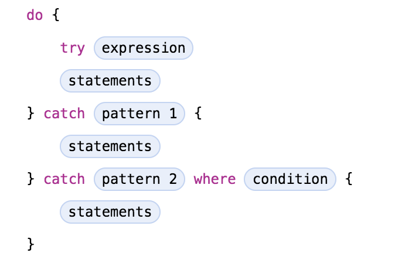

# Errors and exception handling

[Go back to README.md](README.md)

* JAVA
  There are three kinds of exception in JAVA.

  The first is checked exception. Checked exception are exceptional conditions that a well-written application should anticipate and recover from, e.g. java.io.FileNotFoundException.

  The second is error. Errors are exceptional conditions that are external to the application, and that the application usually cannot anticipate or recover from, such as hardware or system problem.

  The third is runtime exception. These exceptions are exceptional conditions that are internal to the application, and that the application usually cannot anticipate or recover from. These usually indicate programming bugs, such as logic errors or improper use of an API.

  In java, three exception handler components can be used to catch and handle the checked exceptions.

  The first step in constructing an exception handler is to enclose the code that might throw an exception within a **try** block. In general, a **try** block looks like the following:

  ```JAVA
    try {
      code
    }
    //catch and finally blocks . . .
  ```
  The segment in the example labeled code contains one or more legal lines of code that could throw an exception.

  Then users can associate exception handlers with a try block by providing one or more catch blocks directly after the try block. No code can be between the end of the try block and the beginning of the first **catch** block.

  ```JAVA
  try {

  } catch (ExceptionType name) {

  } catch (ExceptionType name) {

  }
  ```
  Each **catch** block is an exception handler that handles the type of exception indicated by its argument.

  The **finally** block always executes when the try block exits. It allows the programmer to avoid having cleanup code accidentally bypassed by a return, continue, or break. This ensures that the finally block is executed even if an unexpected exception occurs.

  Here is a example of handling a exception.

  ```JAVA
    public void writeList() {
      PrintWriter out = null;

      try {
          System.out.println("Entering" + " try statement");

          out = new PrintWriter(new FileWriter("OutFile.txt"));
          for (int i = 0; i < SIZE; i++) {
            out.println("Value at: " + i + " = " + list.get(i));
          }
      } catch (IndexOutOfBoundsException e) {
        System.err.println("Caught IndexOutOfBoundsException: "
                           +  e.getMessage());

      } catch (IOException e) {
        System.err.println("Caught IOException: " +  e.getMessage());

      } finally {
        if (out != null) {
            System.out.println("Closing PrintWriter");
            out.close();
        }
        else {
            System.out.println("PrintWriter not open");
        }
      }
  }
  ```

  Before users catch an exception, some code somewhere must throw one.

  All methods use the **throw** statement to throw an exception. The **throw** statement requires a single argument: a throwable object. Throwable objects are instances of any subclass of the Throwable class. Here's an example of a throw statement.

  ```JAVA
  throw someThrowableObject;
  ```
  References:

  <https://docs.oracle.com/javase/tutorial/essential/exceptions/index.html>

---
* Swift

  Swift provides first-class support for throwing, catching, propagating, and manipulating recoverable errors at runtime.

  In Swift, errors are represented by values of types that conform to the **Error** protocol. This empty protocol indicates that a type can be used for error handling.

  Throwing an error indicate that something unexpected happened and the normal flow of execution can’t continue.

  For example, the following code throws an error to indicate that five additional coins are needed by the vending machine:

  ```Swift
    throw VendingMachineError.insufficientFunds(coinsNeeded: 5)
  ```

  In addition, there are four ways to handle errors in Swift. Users can propagate the error from a function to the code that calls that function, handle the error using a do-catch statement, handle the error as an optional value, or assert that the error will not occur.

  * Using throwing functions

    To indicate that a function, method, or initializer can throw an error, users can write the throws keyword in the function’s declaration after its parameters. A function marked with throws is called a throwing function.

    ```Swift
      func canThrowErrors() throws -> String
      func cannotThrowErrors() -> String
      ```

  * Using do-catch

    If an error is thrown by the code in the do clause, it is matched against the catch clauses to determine which one of them can handle the error.

    Here is the general form of a **do-catch** statement:

    

    Users can  write a pattern after **catch** to indicate what errors that clause can handle. If a **catch** clause doesn’t have a pattern, the clause matches any error and binds the error to a local constant named **error**.

  * Converting Errors to Optional Values

    Users can use **try?** to handle an error by converting it to an optional value. If an error is thrown while evaluating the **try?** expression, the value of the expression is nil.

    For example, in the following code x and y have the same value and behavior:

    ```Swift
      func someThrowingFunction() throws -> Int {
        // ...
      }

      let x = try? someThrowingFunction()

      let y: Int?
      do {
        y = try someThrowingFunction()
        } catch {
          y = nil
        }
        ```

  * Disabling Error Propagation

    Sometimes a throwing function or method won’t throw an error at runtime. On those occasions, users can write try! before the expression to disable error propagation and wrap the call in a runtime assertion that no error will be thrown. If an error actually is thrown, users will get a runtime error.

  References:

  <https://developer.apple.com/library/content/documentation/Swift/Conceptual/Swift_Programming_Language/ErrorHandling.html>

---
[Go back to README.md](README.md)
