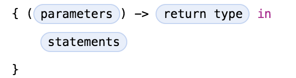
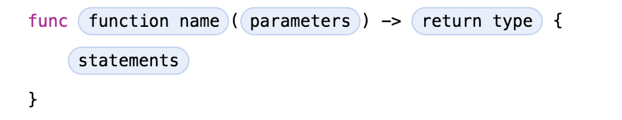

# Lambda expressions, closures, or functions as types
[Go back to README.md](README.md)

* JAVA

  In JAVA, the **lambda** expressions consist of following things:

  * A comma-separated list of formal parameters enclosed in parentheses.

  * The arrow token, ->

  * A body, which consists of a single expression or a statement block.

  Here are some examples:

  ```JAVA
        btn.setOnAction(
         event -> System.out.println("Hello World!")
       );

        p -> {
        return p.getGender() == Person.Sex.MALE
        && p.getAge() >= 18
        && p.getAge() <= 25;
        }       
  ```

  There is a java file that can be viewed - [Java8Tester.java](code/Java8Tester.java).

  References:

  <https://www.tutorialspoint.com/java8/java8_lambda_expressions.htm>

  <https://docs.oracle.com/javase/tutorial/java/javaOO/lambdaexpressions.html#syntax>

---
* Swift

  In the expressions of Swift, there is a expression called closure expression, which is also known as the **lambda** or an anonymous function in other programming languages.

  Like a function declaration, a closure contains statements. It captures constants and variables from its enclosing scope.

  It has the following form:

  

  The function declaration also has the same form.

  

  There are several special forms that allow closures to be written more concisely:

  * A closure can omit the types of its parameters, its return type, or both. If you omit the parameter names and both types, omit the **in** keyword before the statements. If the omitted types can’t be inferred, a compile-time error is raised.

  * A closure may omit names for its parameters. Its parameters are then implicitly named **$** followed by their position: **$0**, **$1**, **$2**, and so on.

  * A closure that consists of only a single expression is understood to return the value of that expression. The contents of this expression are also considered when performing type inference on the surrounding expression.

  Here are some expression in Swift and they are all equivalent:

  ```Swift
    myFunction { (x: Int, y: Int) -> Int in
      return x + y
    }

    myFunction { x, y in
      return x + y
    }

    myFunction { return $0 + $1 }

    myFunction { $0 + $1 }
  ```

  References:

  <https://developer.apple.com/library/content/documentation/Swift/Conceptual/Swift_Programming_Language/Expressions.html>

---
[Go back to README.md](README.md)
