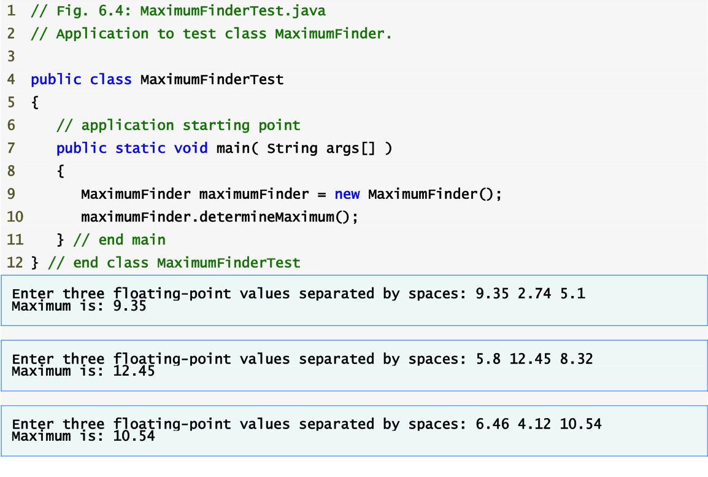

# Procedural programming

[Go back to README.md](README.md)

## Does the language support [procedural programming](https://en.wikipedia.org/wiki/Procedural_programming)?

* JAVA

  Although Java is primarily concerned with the creation of classes and objects, and with the communication between objects, the definitions of methods in Java are primarily imperative/procedural.

  Users can not code anything with out declaring classes and objects, but users can do procedural programming in the methods and let **main** method to run from top to down.

  Here is a example of using java to do the procedural programming.

  

  

  

  References:

  <http://www.math.grin.edu/~rebelsky/Courses/152/97F/Outlines/outline.03.html>

  <http://cs.iupui.edu/~cs240/fall09/slides/t32JavaProceduralProgramming.ppt>

---

* Swift

  Swift adopts the best of C and Objective-C, without the constraints of C compatibility.

  As a result, Swift unifies the procedural and object-oriented portions of the language, which means that swift can do the procedural programming.

  Here is a example that was showed in class:

  ```Swift
  import UIKit

  var names = Array<String>()

  var names2 = [String]()

  names.append("Mike")

  names2.append("Sally")
  names2.append("John")
  names2.append("Kirk")
  names2.append("Sandra")

  names2.sort(by: <#T##(String, String) -> Bool#>)

  for name in names2 {
    print(name)
  }
  ```

  References:
  <http://www.tutorialspoint.com/swift/swift_tutorial.pdf>

---
[Go back to README.md](README.md)
