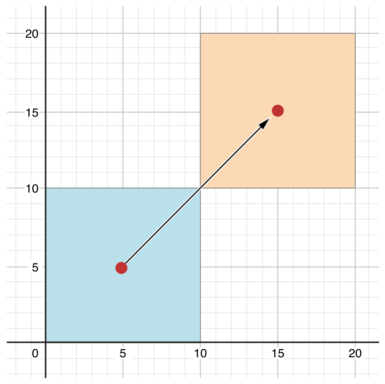

# Properties

[Go back to README.md](README.md)

## Getters and setters...write your own or built in?

* JAVA

  In JAVA, the getters and setters can be written by the users, but it is not required.

  Users are able to create objects and initialise the variables of the object using the constructor. But after that, they can no longer change the values the variables hold. The following statement would result in an error since the variables were declared to be private.

  ```JAVA
  s1.name = "Ravi";
  ```

  The solution lies in providing public methods through which new values can be assigned to these variables and the values they hold can be accessed. These are commonly known as get and set methods. Get methods provide access to the value a variable holds while set methods assign values to the variables of the objects.

   In order to set a variable to a new value, the method needs arguments similar to how the parameterised constructors required details such as rollNumber, name and marks. These required arguments are specified in the method header within the parentheses by specifying the variable name and a data type for that variable name. A set method for name looks as shown below:

   ```JAVA
   public void setName ( String n ) {
   name = n;
   }
   ```

   It is a convention to name the setter methods starting with the word 'set' followed by the variable name that is going to be set. The following statement can set the name for the s1:

   ```JAVA
   s1.setName("Ravi");
   ```

   Now turn to the get method for getting the variables' name. Methods are capable of returning values. These values can be of any primitive data type or reference type like a class. Here, a method that returns a String is needed.  The data type that is going to be returned in specified in the method header instead of the word void. Users can use the word void till now to indicate that a method does not return any value. The get method for name would be the following:

   ```JAVA
   public String getName() {
   return name;
   }
   ```

   The value that is to be returned is specified by using the 'return' keyword. The variable or value that is to be returned follows the return keyword. Users can specify not just a variable name but also a constant or an expression. the following return statements would also be equally fine. return "XYZ";

   ```JAVA
   return "Name: "+name;
   ```

   References:
   <http://www.javawithus.com/tutorial/get-and-set-methods>

---

* Swift

  In Swift, like other languages, getters and setters don't need to be declared for public variables.

  The getter and setter implementation can be overwritten in Swift for all types of variables, including private.

  ```JAVA
  var variableName: dataType {
    get {
        //code to execute
        return someValue
    }
    set(newValue) {
        //code to execute
    }
  }
  ```
  Note:

  Usually used to set getter and setter behavior for classes within classes, and private variables.

  ```Swift
  struct Processor {
    var mhz: Double
    init(mhz: Double) {
        self.mhz = mhz
    }
    var ghz: Double {
        get {
            return mhz * 0.001
        }
        set(newGhz) {
            self.ghz = newGhz
            self.mhz = newGhz * 1000
        }
    }
  }
  ```

  References:
  <https://syntaxdb.com/ref/swift/getters-setters>


## Backing variables?

* JAVA

  A private field that stores the data exposed by a public property is called a backing store or backing field.

  ```JAVA
  Class Student{
    private String name;

    public void setName ( String n ) {
    name = n;
    }

    public String getName() {
    return name;
    }     
  }
  ```

  In the example above, the **name** is a backing variable which stores the data.


---

* Swift

  A backing variable is where the data is actually stored.

  In Swift, backing variables are explicitly declared if needed (usually in code converted from Objective‐C). Also, getters need not use the get keyword. Swift properties can be variables or constants; each type can be either stored or computed, as follows:

  * Declaring a variable property:

    A variable is introduced with the keyword var as in:

    ```Swift
    var _fetchedResultsController:
    NSFetchedResultsController? = nil
    ```

  * Declaring a constant property:

    A constant (that is, a property that cannot be modified) is introduced with the keyword let. The previous declaration can be changed to declare a constant as follows:

    ```Swift
    let _fetchedResultsController:
    NSFetchedResultsController? = nil
    ```

  * Declaring a stored property:

    The declaration of fetchedResultsController shown in the following listing is a typical declaration of a stored property. A stored property is a property stored as part of an instance of the class, enumeration, or structure.

    ```Swift
    // MARK: - Fetched results controller
    var fetchedResultsController: NSFetchedResultsController
    {
    if _fetchedResultsController != nil {
      return _fetchedResultsController!
    }
    let fetchRequest = NSFetchRequest()
    // Edit the entity name as appropriate.
    let entity =
      NSEntityDescription.entityForName("Event",
      inManagedObjectContext: self.managedObjectContext!)
      fetchRequest.entity = entity
    // Set the batch size to a suitable number.
    fetchRequest.fetchBatchSize = 20
    // Edit the sort key as appropriate.
    let sortDescriptor = NSSortDescriptor(key:
      "timeStamp", ascending: false)
    let sortDescriptors = [sortDescriptor]
    fetchRequest.sortDescriptors = [sortDescriptor]
    // Edit the section name key path and cache name if appropriate.
    // nil for section name key path means "no sections".
    let aFetchedResultsController =
      NSFetchedResultsController(fetchRequest:
        fetchRequest,
      managedObjectContext: self.managedObjectContext!,
      sectionNameKeyPath: nil, cacheName: "Master")
    aFetchedResultsController.delegate = self
    _fetchedResultsController = aFetchedResultsController
    var error: NSError? = nil
    if !_fetchedResultsController!.performFetch(&error) {
      // Replace this implementation with code to handle
      // the error appropriately.
      // abort() causes the application to generate a
      // crash log and terminate. You should not use this
      // function in a shipping application, although it
      // may be useful during development.
      println("Unresolved error (error),
        (error.userInfo)")
      abort()
    }
    return _fetchedResultsController!
    }
    var _fetchedResultsController:
    NSFetchedResultsController? = nilBy default, the variable passed into the setter is named newValue,
    and Swift uses the appropriate type for it.
    ```

    The example uses an Objective‐C pattern for a backing variable: Swift stored properties don’t need to begin with a special character such as an underscore; however, they do need to be initialized and given a type (perhaps inferred from the initialization) before they are used.

    ```Swift
    var _fetchedResultsController:
    NSFetchedResultsController? = nil
    ```

  * Declaring a computed property with a getter and a setter:

     This point deserves a bit of elucidation. The listing shows a basic getter and setter of a Swift property. You can see that myVar has a backing variable of myInt. The get and set keywords identify the getter and setter.

     ```Swift
     var myInt:Int = 0
     var myVar: Int {
       get {
         return myInt
       }
       set {
         myInt = newValue
       }
     }
     myVar = 20
     ```

  References:
  <http://www.dummies.com/programming/macintosh/types-of-swift-properties/>

## Computed properties?

* JAVA

  JAVA does not have computed properties. JAVA may use the methods created by users to get or set the backing variables.

* Swift

   classes, structures, and enumerations can define computed properties, which do not actually store a value.

   Instead, they provide a getter and an optional setter to retrieve and set other properties and values indirectly.

   ```Swift
    struct Point {
    var x = 0.0, y = 0.0
    }
    struct Size {
    var width = 0.0, height = 0.0
    }
    struct Rect {
    var origin = Point()
    var size = Size()
    var center: Point {
        get {
            let centerX = origin.x + (size.width / 2)
            let centerY = origin.y + (size.height / 2)
            return Point(x: centerX, y: centerY)
        }
        set(newCenter) {
            origin.x = newCenter.x - (size.width / 2)
            origin.y = newCenter.y - (size.height / 2)
        }
    }
    }
    var square = Rect(origin: Point(x: 0.0, y: 0.0),
                  size: Size(width: 10.0, height: 10.0))
    let initialSquareCenter = square.center
    square.center = Point(x: 15.0, y: 15.0)
    print("square.origin is now at (\(square.origin.x), \(square.origin.y))")
    // Prints "square.origin is now at (10.0, 10.0)"
   ```

   This example defines three structures for working with geometric shapes:

   * **Point** encapsulates the x- and y-coordinate of a point.
   * **Size** encapsulates a **width** and a **height**.
   * **Rect** defines a rectangle by an origin point and a size.

   The **Rect** structure also provides a computed property called **center**. The current center position of a **Rect** can always be determined from its **origin** and **size**, and so you don’t need to store the center point as an explicit **Point** value. Instead, **Rect** defines a custom getter and setter for a computed variable called **center**, to enable you to work with the rectangle’s **center** as if it were a real stored property.

   The preceding example creates a new **Rect** variable called **square**. The square variable is initialized with an origin point of (0, 0), and a width and height of 10. This square is represented by the blue square in the diagram below.

   The **square** variable’s **center** property is then accessed through dot syntax (square.center), which causes the getter for **center** to be called, to retrieve the current property value. Rather than returning an existing value, the getter actually calculates and returns a new **Point** to represent the center of the square. As can be seen above, the getter correctly returns a center point of (5, 5).

   The **center** property is then set to a new value of (15, 15), which moves the square up and to the right, to the new position shown by the orange square in the diagram below. Setting the **center** property calls the setter for center, which modifies the x and y values of the stored origin property, and moves the square to its new position.

   

   References:
   <https://developer.apple.com/library/content/documentation/Swift/Conceptual/Swift_Programming_Language/Properties.html>


---

[Go back to README.md](README.md)
