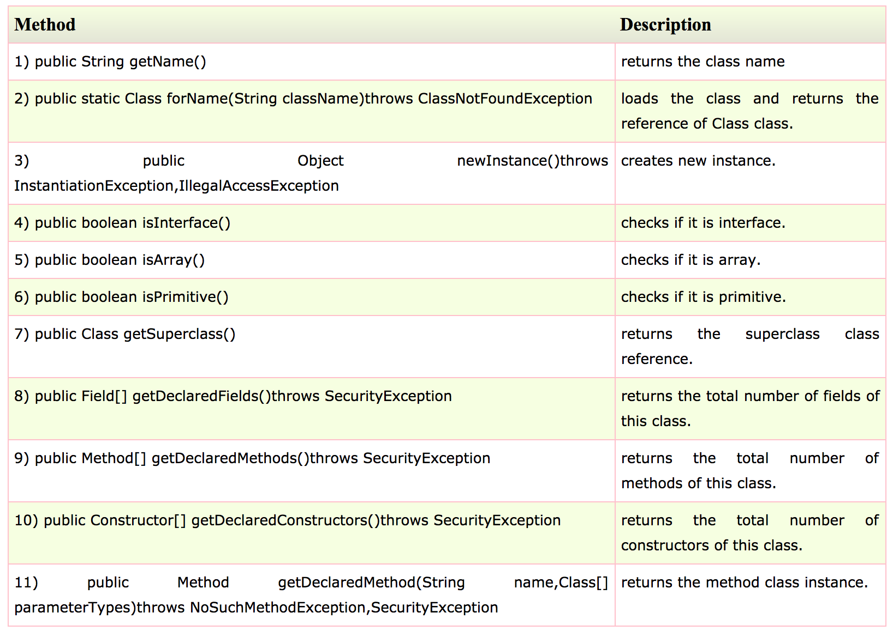

# Reflection

[Go back to README.md](README.md)

## What reflection abilities are supported?

* JAVA

  JAVA reflection is a process of examining or modifying the run time behavior of a class at run time.

  The JAVA reflection uses classes that are packaged in the **java.lang** and **java.lang.reflect**. It can be used in IDE, debugger and test tools.

  The java.lang.Class class provides many methods that can be used to get metadata, examine and change the run time behavior of a class.

  There are some common methods:

  

  References:
  <https://www.javatpoint.com/java-reflection>
---
* Swift

  Swift reflection is based on the **Mirror** struct. Users can create a **Mirror** for a subject and then the mirror can let users to query the information of the subject.

  The mirror contains many types to help users to query the information.

  For example, there is a enum called **DisplayStyle** and it can help to get the type of the subject.

  ```Swift
  public enum DisplayStyle {
  case Struct
  case Class
  case Enum
  case Tuple
  case Optional
  case Collection
  case Dictionary
  case Set
}
  ```

  Next is **AncestorRepresentation** enum, which can be used to query the information of superclass of the subject.

  ```Swift
  public enum AncestorRepresentation {
    /// Generate a default mirror for all ancestor classes.  This is the
    /// default behavior.
    case Generated
    /// Use the nearest ancestor's implementation of `customMirror()` to
    /// create a mirror for that ancestor.      
    case Customized(() -> Mirror)
    /// Suppress the representation of all ancestor classes.  The
    /// resulting `Mirror`'s `superclassMirror()` is `nil`.
    case Suppressed
}
  ```

    References:
    <https://appventure.me/2015/10/24/swift-reflection-api-what-you-can-do/>


## How is reflection used?

* JAVA

  JAVA reflection are defined in the class. TO use the reflection, user need to call the methods of reflection.

  For example, if users want to use reflection to get determining the class object, then three methods of Class class can be used:

  1. public boolean isInterface();
  To determine whether a class is an interface type.
  2. public boolean isArray();
  To determine whether a class represents an array type.
  3. public boolean isPrimitive();
  To determine whether a class represents a primitive type.

  Here is a example:

  ```JAVA
  class Simple{}  
  interface My{}  

  class Test{  
   public static void main(String args[]){  
    try{  
     Class c=Class.forName("Simple");  
     System.out.println(c.isInterface());  

     Class c2=Class.forName("My");  
     System.out.println(c2.isInterface());  

    }catch(Exception e){System.out.println(e);}  

   }  
  }
  ```

  References:
  <https://www.javatpoint.com/java-reflection>
---
* Swift

  For example, there is a definition of **Bookmark**.

  ```Swift
    public class Store {
      let storesToDisk: Bool = true
    }
    public class BookmarkStore: Store {
      let itemCount: Int = 10
    }
    public struct Bookmark {
      enum Group {
        case Tech
        case News
      }
      private let store = {
        return BookmarkStore()
        }()
        let title: String?
        let url: NSURL
        let keywords: [String]
        let group: Group
      }
    let aBookmark = Bookmark(title: "Appventure", url: NSURL(string: "appventure.me")!, keywords: ["Swift", "iOS", "OSX"], group: .Tech)
  ```

    To use the **Mirror**, A mirror needs to be created.

    ```Swift
      let aMirror = Mirror(reflecting: aBookmark)
    ```

    Then users can use following properties and methods on **aMirror**.

    * **let children:Children**:
    The child elements of our subject
    * **displayStyle: Mirror.DisplayStyle?**:
    The display style of the subject
    * **let subjectType: Any.Type** :
    The type of the subject
    * **func superclassMirror() -> Mirror?**:
    The mirror of the subject's superclass

    Printing the properties or using the methods, then users can get the information of the subjects.

    For example, if users want to use **subjectType** to get the type of the subject.

    ```Swift
    print(aMirror.subjectType)
    //prints : Bookmark
    print(Mirror(reflecting: 5).subjectType)
    //prints : Int
    print(Mirror(reflecting: "test").subjectType)
    //prints : String
    print(Mirror(reflecting: NSNull()).subjectType)
    //print : NSNull
    ```

    References:
    <https://appventure.me/2015/10/24/swift-reflection-api-what-you-can-do/#sec-1-4>

---
[Go back to README.md](README.md)
