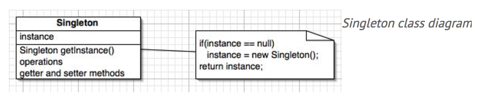

# Singleton
[Go back to README.md](README.md)

## How is a singleton implemented?
* JAVA

  The figure below illustrates the Singleton design pattern class diagram.

  

  Singletons maintain a static reference to the sole singleton instance and return a reference to that instance from a static instance() method.

  Here is a example of a classic singleton.

  ```JAVA
    public class ClassicSingleton {
      private static ClassicSingleton instance = null;
      protected ClassicSingleton() {
        // Exists only to defeat instantiation.
      }
      public static ClassicSingleton getInstance() {
        if(instance == null) {
          instance = new ClassicSingleton();
        }
        return instance;
      }
    }
  ```

  The **ClassicSingleton** class maintains a static reference to the lone singleton instance and returns that reference from the static getInstance() method.

  References:

  <http://www.javaworld.com/article/2073352/core-java/simply-singleton.html>
  
---
* Swift

  In Swift, users can simply use a static type property, which is guaranteed to be lazily initialized only once, even when accessed across multiple threads simultaneously:

  ```Swift
  class Singleton {
    static let sharedInstance = Singleton()
  }
  ```

  References:

  <https://developer.apple.com/library/content/documentation/Swift/Conceptual/BuildingCocoaApps/AdoptingCocoaDesignPatterns.html#//apple_ref/doc/uid/TP40014216-CH7-ID6>


## Can it be made thread-safe?
* JAVA

  The example in the first question is not the thread-safe. To make a singleton thread-safe, users can simply use the **synchronize**.

  Here is the example:

  ```JAVA
    public synchronized static Singleton getInstance() {
      if(singleton == null) {
        simulateRandomActivity();
        singleton = new Singleton();
      }
      logger.info("created singleton: " + singleton);
      return singleton;
    }
  ```

  References:

  <http://www.javaworld.com/article/2073352/core-java/simply-singleton.html>

---
* Swift

  Yes. The swift's singleton can be thread-safe.

  In addition to the example in the first question, there are also two ways that can create the thread-safe singleton.

  One is using the nested struct.

  ```Swift
    class SingletonB {

      class var sharedInstance: SingletonB {
          struct Static {
              static let instance: SingletonB = SingletonB()
            }
            return Static.instance
          }    
    }
  ```

  The other is using **dispatch_once**.

  ```Swift
    class SingletonC {

      class var sharedInstance: SingletonC {
        struct Static {
            static var onceToken: dispatch_once_t = 0
            static var instance: SingletonC? = nil
          }
          dispatch_once(&Static.onceToken) {
            Static.instance = SingletonC()
          }
          return Static.instance!
        }
  }
  ```

  References:

  <https://github.com/hpique/SwiftSingleton>

## Can the singleton instance be lazily instantiated?

* JAVA

  Yes, the singleton instance can be lazily instantiated.   
  Here is a example of the double-checked locking. Double-checked locking is a technique that, at first glance, appears to make lazy instantiation thread-safe. That technique is illustrated in the following code fragment:

    ```JAVA
      public static Singleton getInstance() {
        if(singleton == null) {
          synchronized(Singleton.class) {
            if(singleton == null) {
              singleton = new Singleton();
          }
        }
      }
      return singleton;
    }
    ```

    References:

    <http://www.javaworld.com/article/2073352/core-java/simply-singleton.html>

---
* Swift

  Yes. All three ways that mentioned above to build the singleton are all lazily instantiated.

  References:

  <https://github.com/hpique/SwiftSingleton>

---
[Go back to README.md](README.md)
