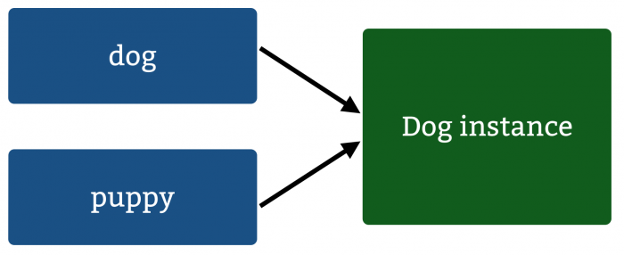
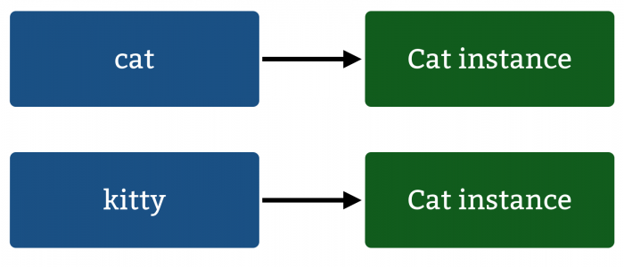

# Types

[Go back to README.md](README.md)

## What types does the language support?

* JAVA

  Primitive data types

|Type|Description|Default|Size|Example Literals|
|----|-----------|-------|----|----------------|
|boolean|true or false|false|1 bit|true,false|
|byte|two complement integer|0|8 bits|(none)|
|char|Unicode character|'\u00000'|16 bits|'a'|
|short|two complement integer|0|16 bits|(none)|
|int|two complement integer|0|32 bits|-2|
|long|two complement integer|0|64 bits|-2L|
|float|IEEE 754 floating point|0.0|32 bits|0.3f|
|double|IEEE 753 floating point|0.0|64 bits|1e1d|


  And other types are reference types (the reference objects).

  References:

  <http://cs.fit.edu/~ryan/java/language/java-data.html>

  <http://stackoverflow.com/questions/8790809/whats-the-difference-between-primitive-and-reference-types>

---
* Swift

  Build-in Data types

  Swift offers the programmer a rich assortment of built-in as well as user-defined data types. The following types of basic data types are most frequently when declaring variables −

  *Int* or *UInt*− This is used for whole numbers. More specifically, you can use Int32, Int64 to define 32 or 64 bit signed integer, whereas UInt32 or UInt64 to define 32 or 64 bit unsigned integer variables. For example, 42 and -23.

  *Float*− This is used to represent a 32-bit floating-point number and numbers with smaller decimal points. For example, 3.14159, 0.1, and -273.158.

  *Double* − This is used to represent a 64-bit floating-point number and used when floating-point values must be very large. For example, 3.14159, 0.1, and -273.158.

  *Bool* − This represents a Boolean value which is either true or false.

  *String* − This is an ordered collection of characters. For example, "Hello, World!"

  *Character* − This is a single-character string literal. For example, "C"

  *Optional* − This represents a variable that can hold either a value or no value.

  **Notice:**
  On a 32-bit platform, Int is the same size as Int32.

  On a 64-bit platform, Int is the same size as Int64.

  On a 32-bit platform, UInt is the same size as UInt32.

  On a 64-bit platform, UInt is the same size as UInt64.

  Int8, Int16, Int32, Int64 can be used to represent 8 Bit, 16 Bit, 32 Bit, and 64 Bit forms of signed integer.

  UInt8, UInt16, UInt32, and UInt64 can be used to represent 8 Bit, 16 Bit, 32 Bit and 64 Bit forms of unsigned integer.

  Bound values:

|Type|Typical Bit Width|Typical Range|
|----|-----------------|-------------|
|Int8|1 byte|-127 to 127|
|UInt8|1 byte|0 to255|
|Int32|4 bytes|-2147483648 to 214748367|
|UInt32|4 bytes|0 to 4294967295|
|Int64|8 bytes|-9223372036854775808 to 9223372036854775807|
|UInt64|8 bytes|0 to 18446744073709551615|
|Float|4 bytes|1.2E-38 to 3.4E+38 (~6 digits)|
|Double|8 bytes|2.3E-308 to 1.7E+308 (~15 digits)|

  References:

  <https://www.weheartswift.com/types/>


## Are both reference and value types supported?

* JAVA

  JAVA supports both reference and value types.

  All the Java primitive types have well-defined standard sizes, so all primitive values can be stored in a fixed amount of memory (between one and eight bytes, depending on the type), but classes and array types are composite types.

  Objects and arrays contain other values, so they do not have a standard size, and they often require quite a bit more memory than eight bytes.

  For this reason, Java does not manipulate objects and arrays directly. Instead, it manipulates references to objects and arrays. Because Java handles objects and arrays by reference, classes and array types are known as reference types. In contrast, Java handles values of the primitive types directly, or by value.

  A reference to an object or an array is simply some fixed-size value that refers to the object or array in some way. Typically, a reference is the memory address at which the object or array is stored. However, since Java references are opaque and cannot be manipulated in any way, this is an implementation detail.

  References:
  <https://docstore.mik.ua/orelly/java-ent/jnut/ch02_10.htm>

---

  * Swift

  Swift also supports both reference and value types.

  Types in Swift fall into one of two categories: first, “value types”, where each instance keeps a unique copy of its data, usually defined as a **struct**, **enum**, or **tuple**.

  The second, “reference types”, where instances share a single copy of the data, and the type is usually defined as a **class**.

  The most basic distinguishing feature of a value type is that copying — the effect of assignment, initialization, and argument passing — creates an independent instance with its own unique copy of its data:

  ```Swift
  // Value type example
  struct S { var data: Int = -1 }
  var a = S()
  var b = a						// a is copied to b
  a.data = 42						// Changes a, not b
  println("\(a.data), \(b.data)")	// prints "42, -1"
  ```

  Copying a reference, on the other hand, implicitly creates a shared instance. After a copy, two variables then refer to a single instance of the data, so modifying data in the second variable also affects the original, e.g.:

  ```Swift
  // Reference type example
  class C { var data: Int = -1 }
  var x = C()
  x.data = 42						// changes the instance referred to by x (and y)
  println("\(x.data), \(y.data)")	// prints "42, 42"
  ```

  Here are some guidelines about how to choose types.

  Use a value type when:

  * Comparing instance data with == makes sense

  * You want copies to have independent state

  The data will be used in code across multiple threads
  Use a reference type (e.g. use a class) when:

  * Comparing instance identity with === makes sense

  * You want to create shared, mutable state

  **Notice:**

  In Swift, Array, String, and Dictionary are all value types. They behave much like a simple int value in C, acting as a unique instance of that data.

  As a result, do not have to do anything special — such as making an explicit copy — to prevent other code from modifying that data.

  Importantly, you can safely pass copies of values across threads without synchronization. In the spirit of improving safety, this model will help you write more predictable code in Swift.

  References:
  <https://developer.apple.com/swift/blog/?id=10>

## Can new value types be created?

  * Java

  No. In java, all the primitives are value types and users can not create new value types.

  References:

  <http://stackoverflow.com/questions/5201329/does-java-make-distinction-between-value-type-and-reference-type>

  However, JAVA is pass by value. To know more , click the link <http://stackoverflow.com/questions/40480/is-java-pass-by-reference-or-pass-by-value/40523#40523>.

  * Swift

  Yes. There are many kinds of value types in Swift, such as struct, enum, and tuples.

  Value types are referenced completely differently than reference types are.

  In Swift, you use class which is implemented using reference semantics.

  ```Swift
  // Reference Types:
  class Dog {
  var wasFed = false
  }
  ```

  The above class represents a pet dog and whether or not the dog has been fed. Create a new instance of your Dog class by adding the following:

  ```Swift
  let dog = Dog()
  ```

  This simply points to a location in memory that stores **dog**. To add another object to hold a reference to the same dog, add the following:

  ```Swift
  let puppy = dog
  ```

  Because **dog** is a reference to a memory address, **puppy** points to the exact same address. Feed your pet by setting wasFed to true:

  ```Swift
  puppy.wasFed = true
  ```

  **puppy** and **dog** both point to the exact same memory address.

  

  Therefore you’d expect any change in one to be reflected in the other.

  ```Swift
  dog.wasFed     // true
  puppy.wasFed   // true
  ```

  Changing one named instance affects the other since they both reference the same object.

  However, using struct will have differences because struct is a value type.

  ```Swift
  struct Cat {
  var wasFed = false
  }

  var cat = Cat()
  var kitty = cat
  kitty.wasFed = true

  cat.wasFed        // false
  kitty.wasFed      // true
  ```

  This shows a subtle, but important difference between reference and value types: setting **kitty**‘s **wasFed** property has no effect on **cat**. The **kitty** variable received a copy of the value of **cat** instead of a reference.

  

  References:

  <https://www.raywenderlich.com/112027/reference-value-types-in-swift-part-1>

---
[Go back to README.md](README.md)
