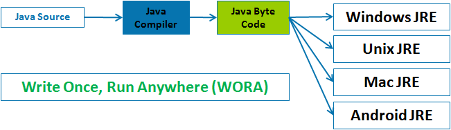

# Unique features of the language

[Go back to README.md](README.md)

## Does the language have any particularly unique features?

* JAVA

  * Simple

    According to [Sun](https://en.wikipedia.org/wiki/Sun_Microsystems)(the former developer of JAVA), Java language is simple because:

    1. Its syntax is based on C++.
    2. It removed many confusing and/or rarely-used features e.g., explicit pointers, operator overloading etc.
    3. No need to remove unreferenced objects because there is Automatic Garbage Collection in java.

  * Platform independent and Portable

    A **Platform** is the hardware or software environment in which a program runs.

    The JAVA platforms differs from most other platforms. It is software-based platform that runs on the top of the other hardware-based platforms.

    It includes two component:
    1. [Runtime Environment](https://en.wikipedia.org/wiki/Runtime_system)
    2. [API(Application Programming Interface)](https://en.wikipedia.org/wiki/Application_programming_interface)

    

    JAVA code can be run on multiple platforms, such as Windows, Linux, Mac/OS. It will be complied by the compiler and converted into bytecode, which is a platform-independent code because it can be run on multiple platforms. As a result, we can say JAVA is [WORA(Write once, run anywhere)](https://en.wikipedia.org/wiki/Write_once,_run_anywhere).

    

    According to its platform independent feature, JAVA is portable, which means that it can be run on any platforms.

  * [Unicode](https://en.wikipedia.org/wiki/Unicode_equivalence) strings

    Many other languages use "byte strings" as the main string type which causes all kinds of problems when working with international characters.

  References:

  Features of JAVA: <http://java.meritcampus.com/core-java-topics/java-and-internet-creating-java-applet>

  Platform Independence in JAVA: <http://java.meritcampus.com/core-java-topics/java-and-internet-creating-java-applet>

---
 * Swift

    * [Syntactic sugar](https://en.wikipedia.org/wiki/Syntactic_sugar)

    Under the Cocoa and Cocoa Touch environments, many common classes were part of the [Foundation Kit](https://en.wikipedia.org/wiki/Foundation_Kit) library. This included the NSString string library (using Unicode), the NSArray and NSDictionary collection classes, and others.

    Objective-C provided various bits of [syntactic sugar](https://en.wikipedia.org/wiki/Syntactic_sugar) to allow some of these objects to be created on-the-fly within the language, but once created, the objects were manipulated with object calls. For instance, concatenating two NSStrings required method calls similar to this:

    ```Objective-C
    NSString *str = @"hello,";
    str = [str stringByAppendingString:@" world"];
    ```

    In Swift, many of these basic types have been promoted to the language's core, and can be manipulated directly. For instance, strings are invisibly bridged to NSString (when Foundation is imported) and can now be concatenated with the + operator, allowing greatly simplified syntax.

    ```Swift
    var str = "hello,"
    str += " world"
    ```

    In addition, JAVA provides special support for the string concatenation operator ( + ), and for conversion of other objects to strings. String concatenation is implemented through the StringBuilder(or StringBuffer) class and its append method.

    ```JAVA
    String str="hello,";
    str + = " world";
    ```

    * File handling

    Swift has file access control levels for symbols: **open**, **public**, **internal**, **fileprivate** and **private**. Compared with other object-oriented languages, these access controls ignore inheritance hierarchies: **private** indicates that a symbol is accessible only in the immediate scope, **fileprivate** indicates it is accessible only from within the file, **internal** indicates it is accessible within the containing module, **public** indicates it is accessible from any module, and **open** (only for classes and their methods) indicates that the class may be subclassed outside of the module.

    * Optionals and chaining

    An important new feature in Swift is option types, which allow references or values to operate in a manner similar to the common pattern in C, where a pointer may refer to a value or may be null. This implies that non-optional types cannot result in a null-pointer error; the compiler can ensure this is not possible.

    Optional types are created with the Optional mechanism—to make an Integer that is nullable, one would use a declaration similar to **var optionalInteger: Optional<Int>**. As in C#, Swift also includes syntactic sugar for this, allowing one to indicate a variable is optional by placing a question mark after the type name, **var optionalInteger: Int?**. Variables or constants that are marked optional either have a value of the underlying type or are **nil**. Optional types wrap the base type, resulting in a different instance. **String** and **String?** are fundamentally different types, the latter has more in common with **Int?** than **String**.

    To access the value inside, assuming it is not nil, it must be unwrapped to expose the instance inside. This is performed with the **!** operator:

    ```Swift
    let myValue = anOptionalInstance!.someMethod()
    ```

    In this case, the **!** operator unwraps the instance **anOptionalInstance** to exposes inside. If **anOptionalInstance** is nil, a null-pointer error occurs, so Swift offers the optional chaining to test whether the instance is nil and will be unwrap it when it is not nil.

    ```Swift
    let myValue = anOptionalInstance?.someMethod()
    ```

    Swift will only call someMethod() if anOptionalInstance is not nil.

    Swift 2 introduced the new keyword guard for cases in which code should stop executing if some condition is unmet:

    ```Swift
    guard let leaseStart = aBuilding.TenantList[5]?.leaseDetails?.startDate else {
    //handle the error case where anything in the chain is nil
    //else scope must exit the current method or loop
    }
    //continue, knowing that leaseStart is not nil
    ```

    * Debugging

    A key element of the Swift system is its ability to be cleanly debugged and run within the development environment, using a [read–eval–print loop (REPL)]<https://en.wikipedia.org/wiki/Read%E2%80%93eval%E2%80%93print_loop>, giving it interactive properties more in common with the scripting abilities of [Python]<https://en.wikipedia.org/wiki/Python_(programming_language)> than traditional system programming languages. The REPL is further enhanced with the new concept **playgrounds**.

    **Playgrounds**  are interactive views running within the Xcode environment that respond to code or debugger changes on-the-fly. If some code changes over time or with regard to some other ranged input value, the view can be used with the Timeline Assistant to demonstrate the output in an animated way.

    Apple claims that Swift "is the first industrial-quality systems programming language that is as expressive and enjoyable as a scripting language".

    * [Tuple](https://en.wikipedia.org/wiki/Tuple)

    Swift tuples offer compound variables. A tuple lets users group multiple elements into a single compound variable. The values in a Swift tuple can be of any type and don't have to be the same type as each other.

    The users can make a tuple from any permutation of types: (Int, Int, Int) or (int, String) or (String,Bool) or whatever else that are needed.

  References:

  Class String: <https://docs.oracle.com/javase/7/docs/api/java/lang/String.html>

  Swift:
  <https://en.wikipedia.org/wiki/Swift_(programming_language)#Features>

  10 Things You Should Know About Apple's Swift: <http://www.cio.com/article/2456100/mobile-development/10-things-you-should-know-about-apples-swift.html>
  
---
[Go back to README.md](README.md)
